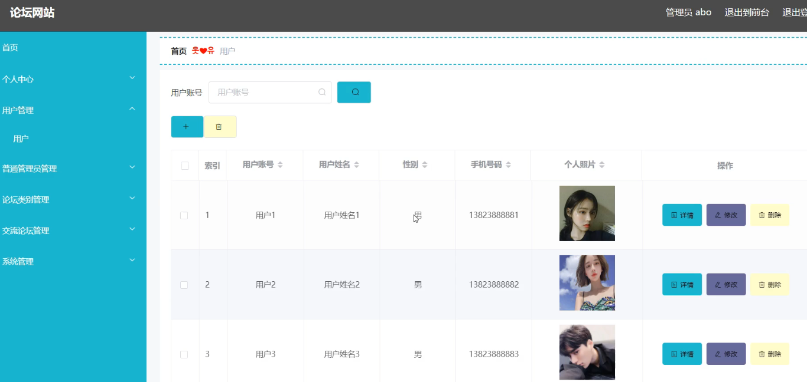
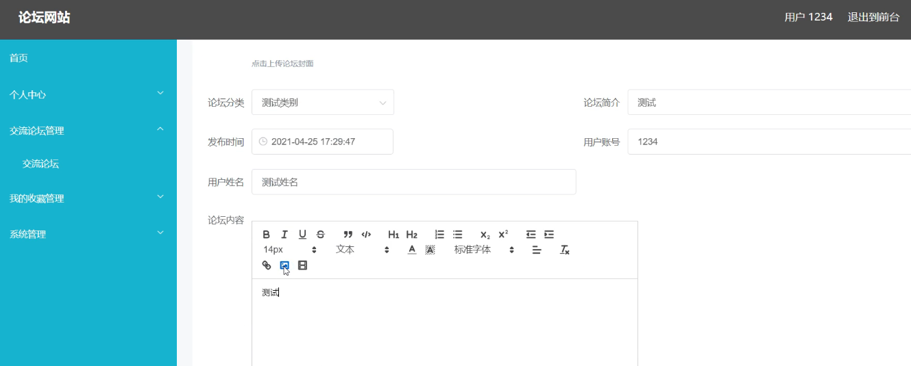
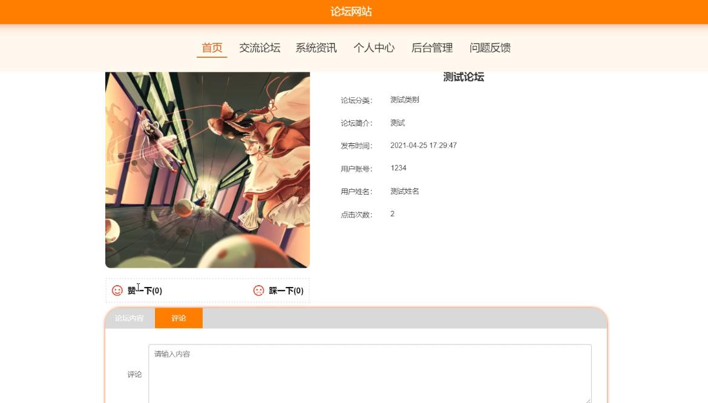

**项目简介：**  
本项目基于主流的前后端分离架构，采用 **SpringBoot + Vue 技术栈**，配套 **MySQL 数据库**，适用于毕业设计与课题实训开发。  
本人已整理了超 **4000 多套毕业设计源码+论文+开题报告+PPT...**，涵盖 **Java、SpringBoot、Vue、SSM、uni-app 小程序、PHP、Android** 等方向，支持功能修改定制与论文服务。  
**团队提供以下服务：**  
- 项目代码修改与调试  
- 数据库配置与远程协助  
- 论文定制与修改  
**获取更多的4000多套源码或SQL文件请联系：**  
- QQ：3906443360 微信：BesheHelp

# springboot084基于springboot的论坛网站

（1）问题反馈信息的实体属性图如下：

图4.12  问题反馈信息实体属性图

（2）系统资讯信息实体属性图如图4.13所示：

图4.13  系统资讯信息实体属性图

（3）论坛类别信息实体属性图如图4.14所示：

图4.14 论坛类别信息实体属性图

4.3.2数据库设计表

论坛网站需要后台数据库，下面介绍数据库中的各个表的详细信息：

表4.1 问题反馈

表4.2 交流论坛评论表

表4.3 交流论坛

表4.4 论坛类别

表4.5 系统资讯

表4.6 普通管理员

表4.7 收藏表

表4.8 管理员表

表4.9 用户

5系统详细实现

5.1 管理员模块的实现

5.1.1 用户信息管理

论坛网站的系统管理员可以管理用户，可以对用户信息添加修改删除以及查询操作。具体界面的展示如图5.1所示。

图5.1 用户信息管理界面

5.1.2 普通管理员管理

系统管理员可以查看对普通管理员信息进行添加，修改，删除以及查询操作。具体界面如图5.2所示。

图5.2 普通管理员信息管理界面

5.2 用户模块的实现

5.2.1 交流论坛

用户登录可以发布交流论坛。界面如下图所示：

图5.5 交流论坛界面

5.2.2 交流论坛评论

用户登录后可以对其他用户发布的论坛信息进行评论操作。界面如下图所示：

图5.6 交流论坛评论信息界面